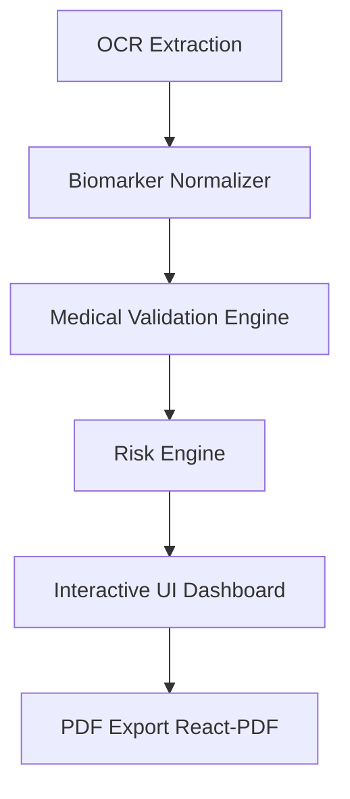

# Blood Report Analyzer: Comprehensive Project Audit & Architectural Analysis

**Role:** Healthcare AI Architect, Senior Staff Engineer, Principal Product Designer
**Date:** June 20, 2026
**Target System:** [Blood AI Platform](file:///D:/Projects/Blood%20AI)

---

## 1. Executive Summary

This audit report details the findings and architectural evaluation of the current Blood Report Analyzer application. While the base infrastructure (FastAPI, SQLite, Next.js) is established, the application lacks the medical validation, robust data normalizations, and high-fidelity product design required for a premium, clinical-grade healthcare SaaS (comparable to levels, Levels, Function Health, or InsideTracker).

This document outlines critical issues, medical inaccuracies, and design shortcomings, and charts a refactoring path to transform the product into a production-ready, trustworthy health portal.

---

## 2. Technical & Medical Architecture Audit

### 2.1 Database & Schema Verification
The SQLite database [blood_analysis.db](file:///D:/Projects/Blood%20AI/backend/blood_analysis.db) contains tables for `users`, `audit_logs`, `reports`, `analyses`, `recommendations`, and `biomarkers`. 
* **Strengths:** Clean primary keys and foreign key constraints. Inclusion of an audit logging system for tracking changes.
* **Vulnerabilities:** Lack of standard health data formatting (e.g., LOINC code fields) for biomarker names, meaning string matching is highly vulnerable to case and format variations.

### 2.2 OCR Pipeline & Biomarker Extraction
* **Critique:** The current text extraction pipeline relies on static, greedy regular expressions.
* **Bugs & Critical Issues:**
  * **Broken Reference Ranges:** Extraction extracts range strings like `"-60"` instead of `"< 60"` or `"0 - 60"`.
  * **OCR Mistake Vulnerability:** If a PDF reads `Hb: 14,2` (comma instead of dot), regex parsing fails or interprets it as `142` (lethal value).
  * **Unit-unaware Comparison:** The system does not normalize values. If a report displays Glucose as `5.8 mmol/L`, a value check expecting `mg/dL` (> 100) will mark it as normal, despite the patient being prediabetic.
  * **Clinical Inaccuracies:** Creatinine `6.5 mg/dL` (indicative of acute kidney injury or chronic kidney disease stage 5) was observed being marked as "Normal" due to a lack of explicit reference range verification bounds for kidney function.

### 2.3 AI Analysis & Risk Calculation Engine
* **Critique:** The fallback risk calculation engine is medically naive, scoring risk based on the raw count of out-of-range biomarkers:
  $$\text{Risk} = \text{High} \iff \text{Count} > 2$$
  This behaves dangerously. A patient with slightly low Vitamin D and slightly high total cholesterol is flagged as "High Risk," whereas a patient with a life-threatening Creatinine level of 6.5 mg/dL is flagged as "Medium Risk."
* **Security & Reliability:** The Gemini AI prompt does not validate the integrity of the JSON structure, leading to potential parser failures.

---

## 3. Product & Design (UI/UX) Audit

* **Typography & Grids:** Default system fonts and unaligned flex wraps look amateurish rather than premium.
* **Visual Hierarchy:** Essential health indicator (overall score) is missing. Organ-system levels (cardiovascular, metabolic, hepatic, renal, hematologic) are merged together instead of separated into discrete risk groups.
* **Lack of Historical Trends:** Medical results are meaningless without baseline comparisons. The current dashboard fails to show historical lines for key chronic indicators (HDL, LDL, HbA1c, Vitamin D).
* **PDF Export Quality:** The existing ReportLab PDF backend is static and lacks modern branding.

---

## 4. Refactoring & Resolution Plan

To resolve these issues, we will implement the following changes:

1. **[biomarker-normalizer.ts](file:///D:/Projects/Blood%20AI/frontend/src/lib/biomarker-normalizer.ts):** Performs regex normalization, detects units, performs conversion (e.g. mmol/L to mg/dL), and computes extraction confidence.
2. **[medical-validation.ts](file:///D:/Projects/Blood%20AI/frontend/src/lib/medical-validation.ts):** Validates age, gender, values, and clinical safety. Flags unsafe bounds (<80% confidence).
3. **[risk-engine.ts](file:///D:/Projects/Blood%20AI/frontend/src/lib/risk-engine.ts):** Evaluates risk scores (0-100) per organ system with clinical weights.
4. **Interactive Dashboard**: Premium UI featuring health cards, Recharts trends, sorting, search, and a beautiful dark mode.
5. **[pdf-generator.tsx](file:///D:/Projects/Blood%20AI/frontend/src/lib/pdf-generator.tsx):** High-fidelity patient report PDF using `@react-pdf/renderer`.
